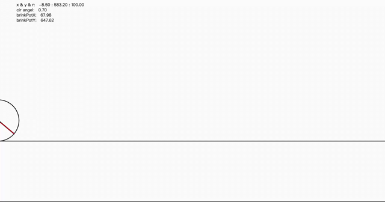

## Runing Cycle

A running cycle implemented using JavaScript:

- It will keep running repeatedly.
- You can make it jump by pressing the space button.
- You can stop it by placing the mouse cursor in front of the cycle."

